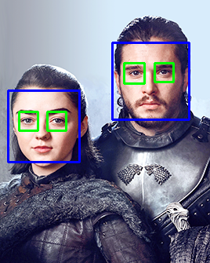
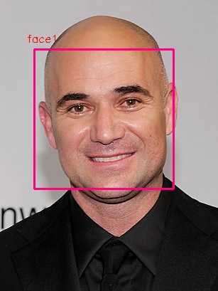
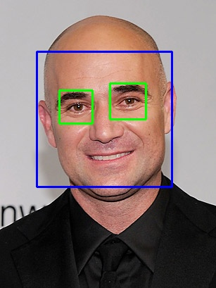
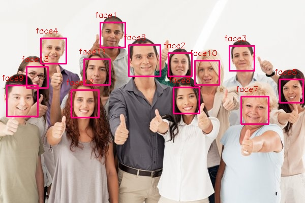

# Face-Detection-in-Image-and-Video-using-Haarcascade

## Arguments to run the program

**For face detection in image**
>python face_detection_image.py --image images/test3.jpg --output output/test_result3.jpg 

**For eye detection in image**
>python eye_detection_image.py --image images/test4.png --output output/test_eye2_result.png

**For face detection in video**
>python face_detection_video.py --video videos/test.mp4

## Detection Results

